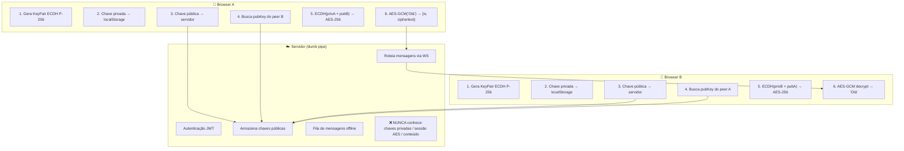

# Web Chat E2EE

Projeto de estudo para compreensão de mecanismos de criptografia em aplicações web.

Chat web com criptografia de ponta a ponta (E2EE). O servidor atua apenas como intermediário de transporte — toda criptografia acontece exclusivamente nos navegadores dos clientes.

## Testar Online

[https://e2ee-chat-w82o.onrender.com](https://e2ee-chat-w82o.onrender.com)

## Funcionamento



## Funcionalidades

- Autenticação com JWT (registro e login)
- Geração de par de chaves ECDH P-256 no cliente
- Derivação de chave de sessão AES-GCM via ECDH
- Criptografia e descriptografia AES-GCM
- Troca de mensagens em tempo real via WebSocket
- Fila de mensagens offline
- Persistência de chave privada e sessões no localStorage

## Stack

| Camada       | Tecnologia                       |
|-------------|----------------------------------|
| Frontend    | React 18, Vite, TypeScript       |
| Backend     | Node.js, Express, ws, TypeScript |
| Criptografia| Web Crypto API (SubtleCrypto)    |
| Autenticação| JWT, bcrypt                      |
| Hospedagem  | Render                           |

## Executar Localmente

```bash
npm install
npm run dev:server   # Backend em http://localhost:3001
npm run dev:client   # Frontend em http://localhost:5173
```

## Estrutura

```
client/src/
├── api/        # HTTP + WebSocket
├── auth/       # Estado de autenticação
├── crypto/     # Camada isolada de criptografia
├── store/      # localStorage
├── hooks/      # React hooks
├── components/ # UI
└── types/

server/src/
├── auth/       # Registro/login
├── users/      # Gerenciamento de usuários
├── keys/       # Chaves públicas
├── messages/   # Roteamento e fila offline
├── ws/         # WebSocket
└── middleware/
```
